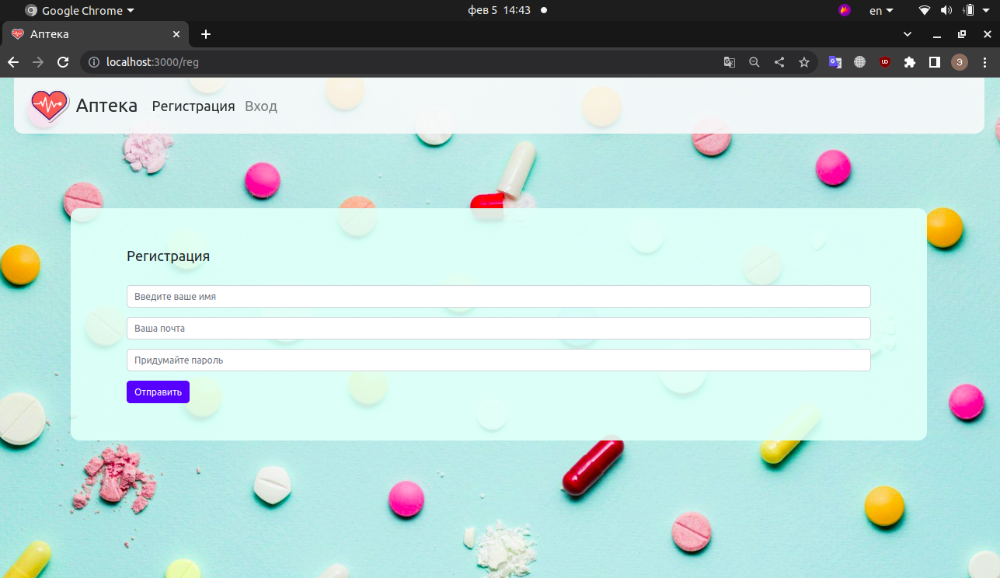
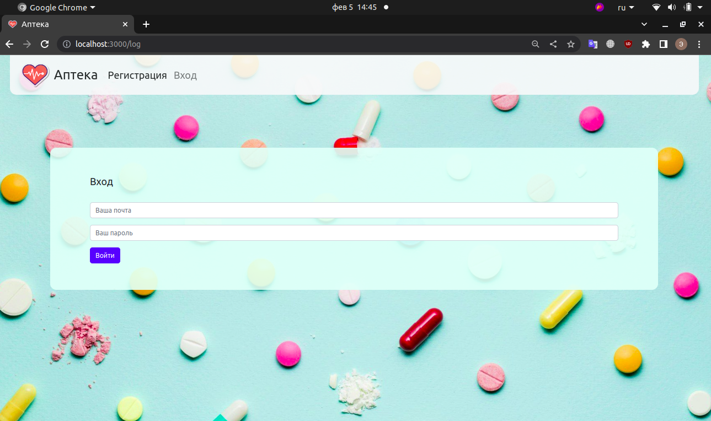
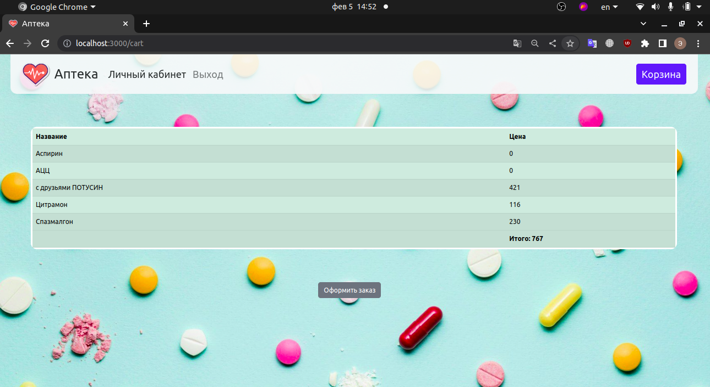
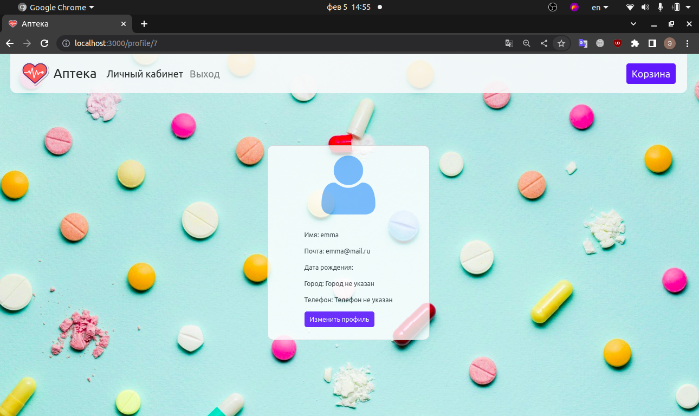

# PharmacyShop

[README in russian](README_RUS.md)

## About this project

This is a training project 'from the customer', developed in a team in a tight timeframe (2 days).

We were assigned to develop a website for a social pharmacy.
The main difference from a normal pharmacy is that 3 products are given away for free every week. These products were to be placed in a separate block on the homepage.

Registration and authorisation are implemented in the project.

The shopping cart is only available after the user has logged into his/her account.
The cart button also has a counter of items placed in it.

Clicking on the "Shopping Cart" button will take the user to the relevant section where he/she can see all the products he/she has selected and their prices.

The page also has a "Checkout" button.

A personal account is available to the user.
By default, user information includes only a name and email address.

There is a button 'Edit profile' in the personal account.
Clicking on it will take the user to the page where he/she can edit his/her details. Here users can change
- name
- email address
- date of birth
- city,
- telephone number.

The information in the user account will be updated after the user confirms the changes by clicking the "'Send data" button.

## Available Scripts

In the project directory, you can run:

- ### `npm start`

  Runs the app in the development mode.
  Open [http://localhost:3000](http://localhost:3000) to view it in your browser.

- ### `npm run dbr`

  Recreate all database:
  delete the old database, create new database, run all migrations & run all seeds.

## Technologies used

- the project is written in JavaScript, Express framework,
- React SSR is used for rendering,
- database uses PostgreSQL dialect,
- [Sequelize](https://www.npmjs.com/package/sequelize) is used to communicate with the database,
- password encryption uses [bcrypt](https://www.npmjs.com/package/bcrypt)

## It was planned for implementation in the future

- automatic sending of an email to the user after the order has been placed,
- automatic emptying of the shopping cart after the order has been placed,
- editing the number of items in the cart.
