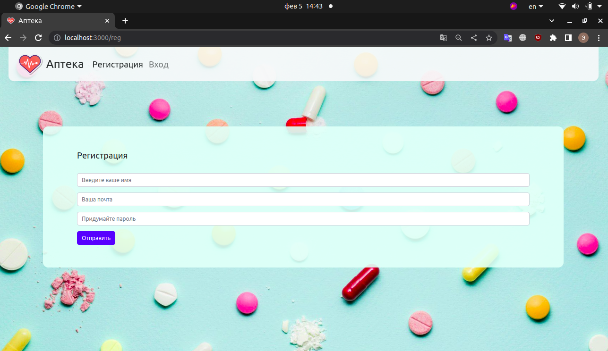
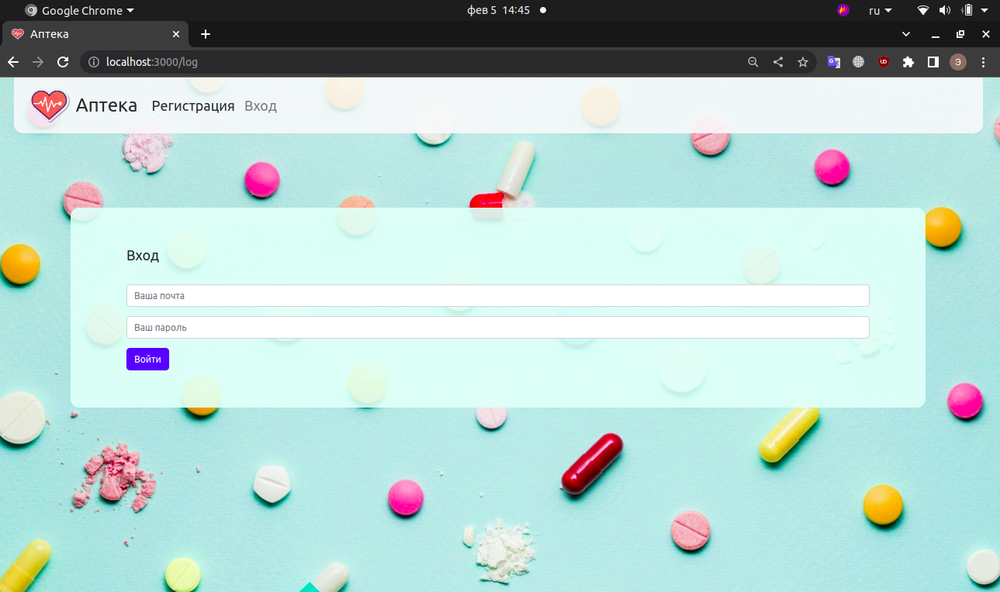
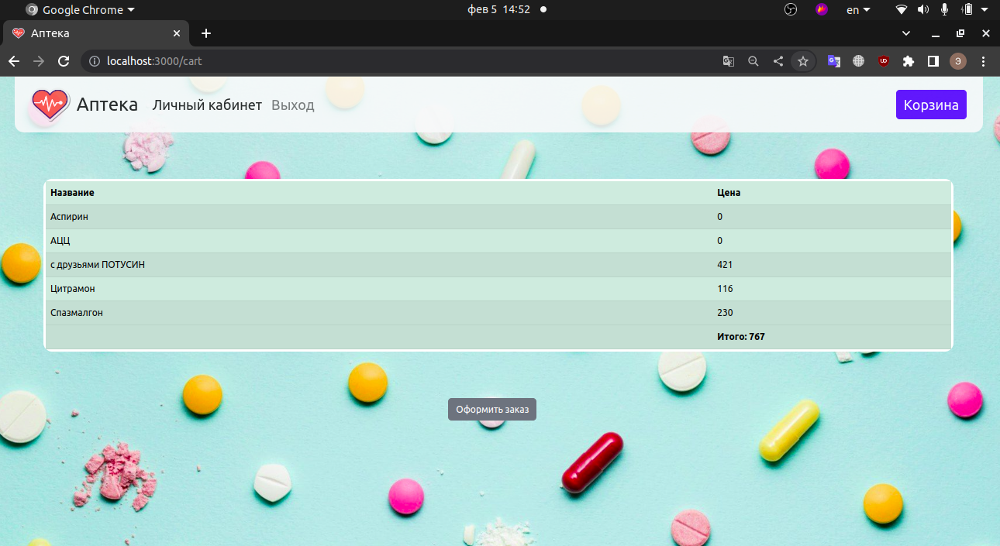
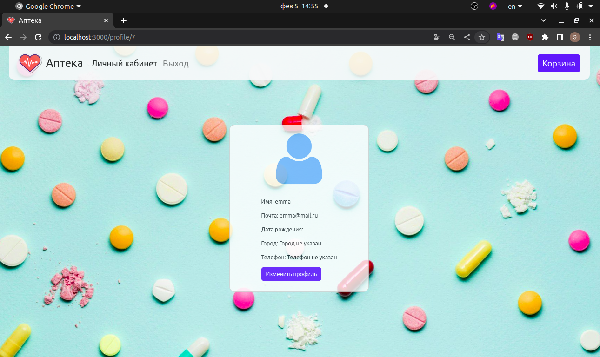

# PharmacyShop

[README in english](README.md)

## Информация о данном проекте

Это учебный проект "от заказчика", разработанный в команде в сжатые сроки (2 дня).

Нам было поручено разработать сайт социальной аптеки.
Главное отличие от обычной аптеки заключается в том, что каждую неделю 3 товара отдаются бесплатно. Эти товары должны быть вынесены в отдельный блок на главной странице.

В проекте реализована регистрация и авторизация.

Корзина становится доступной только после того, как пользователь вошел в свою учетную запись.
Также на кнопке корзины есть счётчик положенных в неё товаров.

По нажатию на кнопку корзины пользователь попадает в соответствующий раздел, где может увидеть все выбранные им товары и их цены.

На странице присутствует кнопка "оформить заказ".

Пользователю доступен личный кабинет.
По умолчанию в информации о пользователе есть только имя и адрес электронной почты.

В личном кабинете есть кнопка "Изменить профиль".
После нажатия на неё, пользователь попадает на страницу редактирования своих данных. Здесь он может изменить:
- имя,
- адрес электронной почты,
- дату рождения,
- город,
- номер телефона.

После подтверждения изменений по кнопке "Отправить данные", информация в личном кабинете обновляется.

## Доступные команды

Запуск проекта осуществляется командой `npm start`.

Пересоздание базы данных осуществляется командой `npm run dbr`.
(А именно: удаление старой БД, создание новой, запуск миграций, запуск сидов.)

## Используемые технологии

- проект написан на JavaScript, фреймворк Express,
- для рендера используется React SSR,
- база данных использует диалект PostgreSQL,
- для связи с БД используется [Sequelize](https://www.npmjs.com/package/sequelize),
- для шифрования паролей использован [bcrypt](https://www.npmjs.com/package/bcrypt)

## К реализации в дальнейшем планировалось

- автоматическая отправка письма пользователю после оформления заказа,
- автоматическая очистка корзины после оформления заказа,
- редактирование количества товаров в корзине.
